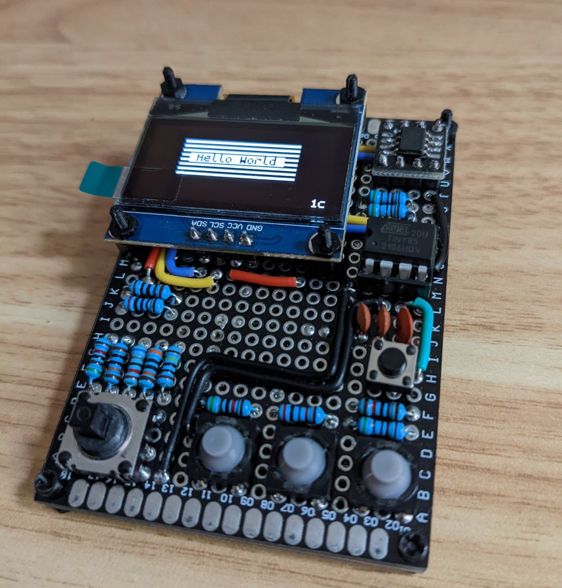

# Archie Tiny OS (ATtiny85)

- https://hackaday.io/project/185844-archie-tiny

<p align="center">
  
</p>


- https://www.youtube.com/playlist?list=PLuCmHWky5GN4iyRNNchJ4GMcVCSOgdOvc
- http://www.avr-asm-tutorial.net/
- https://blog.oddbit.com/post/2019-01-22-debugging-attiny-code-pt-1/
- http://www.rjhcoding.com/avr-asm-macros.php
- https://www.youtube.com/watch?v=tFSTG7XEboI&list=PLuCmHWky5GN4iyRNNchJ4GMcVCSOgdOvc&index=5
- https://ftp.gnu.org/pub/old-gnu/Manuals/gas-2.9.1/html_chapter/as_7.html


### Portability (CR2477 at 1000 mAh??)
- https://www.batteriesandbutter.com/coin_batttery_chart.html
- http://howardtechnical.com/voltage-divider-calculator/


## Debugging
- https://github.com/vince-br-549/ESP8266-as-ISP
- https://randomnerdtutorials.com/arduino-poor-mans-oscilloscope/
- https://sites.google.com/site/wayneholder/debugwire2
- https://sites.google.com/site/wayneholder/attiny-fuse-reset
- https://sites.google.com/site/wayneholder/attiny-fuse-reset-with-12-volt-charge-pump

## Deps

```
sudo apt-get install avr-libc binutils-avr gcc-avr avrdude
sudo apt install simavr
```


## Simulator

- use simavr + gdb combo - see Makefile sim: and gdb: labels
- simavr clock seems difficult to manage (need to verify) - https://github.com/buserror/simavr/issues/201
- see debug.gdb for hacky time estimation command

to compile simavr, we need glut
```
sudo apt install freeglut3-dev
```

# Digispark
### fuses
- Low fuse: 0xe1  -- 16 MHz mode with no clock divide
- High fuse: 0x5d -- EEPROM not preserved, brown-out detection enabled at 2.7v
- Extended fuse: 0xfe -- Self-programming enabled


# Raw attiny85 using ATTinyDebugTools

https://github.com/shashfrankenstien/ATTinyDebugTools

Function| ATTinyDebugTools | ATtiny85
---|---|---
SCK | D13 | pin 7
MISO | D12 | pin 6
MOSI | D11 | pin 5
VCC | D10 | pin 8
RESET | D6 | pin 1
GND | GND | pin 4

### default fuses
- Low fuse: 0x62  -- 8 MHz mode with clock divide by 8 (1 MHz)
- High fuse: 0xdf -- SPI enabled, EEPROM not preserved
- Extended fuse: 0xff  -- Self-programming disabled

### change to 16 MHz clock
- Low fuse: 0xe1  -- 16 MHz mode with no clock divide

### change to preserve eeprom + brownout detection
- High fuse: 0xd7  -- EEPROM preserved
- High fuse: 0xd6  -- EEPROM preserved + brown out detection at 1.8 volts


# Power Management
- disable Timer1 since we are not using that for anything at the moment (PRR bit 3)
- disable brown-out detection through software while deep sleep
- MCUCR – MCU Control Register - Bit 5 – SE: Sleep Enable
    - The SE bit must be written to logic one to make the MCU enter the sleep mode when the SLEEP instruction is executed
-----

# ArchieTiny implementation NOTES

- Timer 0 in CTC mode - TCNT0,TCCR0A,TCCR0B,OCR0A
- Timer compare A interrupt at addr 0x000A; enabled in TIMSK
- Ugh, need to add `-nostartfiles` to avr-gcc so it doesn't include weird extra code that kills interrupts.
    - This also eliminates need to create and expose a global `main` routine

## Time and Delays (lib/timer.asm)
- Features
    - 24 bit software time counter - this requires that `timer_tick_isr` is attached to an interrupt that triggers every 1 millisecond
    - also includes a sort of accurate clock cycle counter delay. (see `timer_delay_clock_cycles` subroutine)
- Ticks are stored in RAM addressed by TIME_SOFT_COUNTER config variable
    - HIGH_BYTE:MIDDLE_BYTE:LOW_BYTE
    - TIME_SOFT_COUNTER+2:TIME_SOFT_COUNTER+1:TIME_SOFT_COUNTER

## Resource Status Registers
- Each of the below resources are allocated 1 register of size 1 byte to store custom status flags
- Each of these status registers are described within their corresponding modules

Resource | Register config name | Module
---------|----------------------|-------------
Oled     | SREG_OLED            | sh1106.asm
GPIO     | SREG_GPIO_PC         | gpio.asm
I2C      | I2C_BUS_RLOCK        | usi_i2c.asm


## Task Manager (lib/tasks.asm)
Tasks Table is set up starting at RAM address TASK_RAM_START (Should be greater than 0x60 = 32 general registers + 64 I/O registers).

### Task table
- First byte will be the task counter (TASKCTS)
- Second byte will be current task index (TASKPTR)
- Next addresses will contain word size values of task stack pointers

```
         _________
        |_________| --> TASKCTS - task counter and status register (1)
        |_________| --> TASKPTR - current task index / pointer (1)
        |_________| --> task stack pointers vector (TASK_MAX_TASKS*2)
        |         | --> task stack 1 (TASK_STACK_SIZE)
        |_________|
        |         | --> task stack 2 (TASK_STACK_SIZE)
             .
             .
```

### Task workflow
- init
    - set TASKCTS and TASKPTR to 0
- add new task
    - increment TASKPTR till we find an empty slot in TASK_SP_VECTOR
    - calculate stack pointer address and store in TASK_SP_VECTOR at TASKPTR index
    - jump to task's alotted stack
    - store return address, function pointer + manager pushed registers on the stack
        - Note: Because of how the stack works, function pointer address should be divided by 2. cpu will then multiply it by 2 before executing (or we can use pm() apparently)
    - if TASK_SP_VECTOR is full, set FULL flag in TASKCTS
- exec task
    - read TASKCTS counter, if eq 0 or 1, simply return because there is no task switching required
    - if RUNNING bit is set, there was previously a task that was running
    - push registers + SREG to stack, read TASKPTR, save stack pointer in TASK_SP_VECTOR at TASKPTR index
    - increment TASKPTR to go to next task
        - initially, TASKPTR will be 0
        - if TASKPTR overflows beyond TASK_MAX_TASKS, wrap around to 0
    - load stack pointer value from TASK_SP_VECTOR at TASKPTR index
    - set new stack pointer, pop all registers + SREG
    - reti


## I2C
- Built-in USI I2C
    - outputs USIDR MSB on SDA line on falling edge of SCL
    - slave devices read on rising edge of SCL
    - slave addresses seem to be shifted left
        - for example, in SH1106, documentation says addresses are 0111100 and 0111101, but in reality, device only reponds to 01111000 and 01111001
- I2C can only be used by one task at a time. Before using I2C, a task has to acquire a lock

- I2C_BUS_RLOCK - i2c reentrant lock register (1)
```
   -------------------------------------------------------------------------------------
   | RLKCNT3 | RLKCNT2 | RLKCNT1 | RLKCNT0 | TASKPTR3 | TASKPTR2 | TASKPTR1 | TASKPTR0 |
   -------------------------------------------------------------------------------------
```
  - i2c lock is task specific - meaning, each task can acquire locks multiple times (reentrant)
          they only need to release it as many times to fully release the i2c lock
  - a lock can be acquired only if RLKCNT (I2C_BUS_RLOCK[7:4]) is 0
  - when a lock is acquired, I2C_BUS_RLOCK[3:0] is set to current TASKPTR value, and RLKCNT is incremented
  - when a lock is released, RLKCNT is decremented. When it reaches 0, the lock is fully released
  - tasks using i2c should use i2c_rlock_acquire and i2c_rlock_release
      these routines facilitate wait-aquire-release workflow
- i2c_rlock_acquire will sleep till lock can be acquired
  it returns once it is able to acquire the lock


## OLED display (using I2C)
- In SH1106 driver, 128x64 OLED is centered in most cases within the 132x64 ram, that means pixel (2,0) in ram is pixel (0,0) on the display
- SH1106 Command Table is on page 30 of the datasheet
- documentation and resources recommend sleeping for 100 ms before displaying anything on the screen
- fonts - https://github.com/Tecate/bitmap-fonts - see vendor/bdf_fonts for more
    - bitocra7
    - spleen
    - unscii-fantasy
- when including strings in program memory, we need to mind byte alignment.
    use `.balign 2` after each string definition
- SREG_OLED is used to track color inversion (highlight) and page scroll position

## OLED text-mode (lib/textmode.asm)
- this module wraps oled and provides helper routines to print continuous text
- it handles control characters
    - '\n' as newline
    - '\b' as backspace
- also manages page scrolling


## Controls
### Button press event manager (PCINT)
- digital pin change interrupts (active low) - interrupt triggers for both falling and rising edges
    - on falling edge (button press), both GPIO_BTN_x_PRS and GPIO_BTN_x_HLD bits are set in SREG_GPIO_PC
    - Any program handling button press must clear GPIO_BTN_x_PRS bit after handing the press
    - on rising edge interrupt (button release), GPIO_BTN_x_HLD bits are automatically cleared

### Button press (voltage divided ADC)
- ADC ISR writes 8-bit precision byte from ADC_CHAN_x to ADC_CHAN_x_VAL register. We can use this byte to identify button press and release
- We need to check expected voltage levels in ascending order
    - only 1 button can be pressed at a time per channel.
    - check lowest voltage threshold. If ADC reading is lower, set ADC_VD_CHx_BTN_y bit in r16 indicating press
    - continue checking as long as no press is identified

- Reading button presses (Software stabilization)
    - ADC clock speed is clk / 128. for clk = 16 MHz, ADC clock speed will be 125 kHz
    - ADC generally takes about 13 - 15 ADC clocks to perform a conversion.
    - Let's approx to 14 which gives us a conversion frequency of ~9 kHz (i.e. each conversion takes ~110 micro seconds)
    - We're using a 680 pF capacitor against 50 k ohm internal pull-up (RESET pin) for smoothing. So, time to charge up to 63% is (50 * 10^3 * 681 * 10^-12) = 34 micro seconds (TAO).
        We might read a wrong value during this charge / discharge time. We can assume that the capacitor will be reasonably full at 5 * TAO
    - Given the ADC conversion period (110 micro seconds), we should make sure multiple readings are within threshold to confirm a button press
    - To be absolutely safe, we can take a bunch of readings waiting a few ms between them; report a press only if all the readings pass the same threshold

- ADC voltage divider value calculation (RESET pin)
    - tested on RESET pin (internal pull up resistance (R1))
    - because we're using the reset pin, input voltage cannot be below ~1.3 v (documentation says 0.9 v :/)

    - equations (only care about 8 MSB precision)
        - VOUT = lambda VIN, R1, R2: VIN * R2/(R1+R2)
        - ADC_VAL = lambda VREF, VOUT: int((VOUT * 1024) / VREF) >> 2

    - approx measured / fudged values that worked out in tests
        - VREF = Vcc = 2.78 v
        - VIN = Vpin = 2.42 v
        - R2 = RESET pin pull-up = 50 kilo ohm aprox (guess??)

- The voltages are usually below these values. just to be sure, we set the threshold to be a few counts above these values (see config.inc)

ADC button        | Resistance (R2) | Voltage | ADC threshold (8 MSB precision) | | V1 Mapping
------------------|-----------------|---------|---------------------------------|-|-------------
ADC_VD_CH0_BTN_0  | 51 K            | 1.222 v | 0x70    | 0b01110000            | NAV_UP_BTN
ADC_VD_CH0_BTN_1  | 68 K            | 1.395 v | 0x80    | 0b10000000            | NAV_DOWN_BTN
ADC_VD_CH0_BTN_2  | 100 K           | 1.613 v | 0x94    | 0b10010100            | NAV_LEFT_BTN
ADC_VD_CH0_BTN_3  | 300 K           | 2.074 v | 0xbf    | 0b10111111            | NAV_RIGHT_BTN
ADC_VD_CH0_BTN_4  | 1 M             | 2.305 v | 0xd4    | 0b11010100            | OK


- similarly, chanel 2 (R1 = 37 kilo ohm, VREF = VIN = vcc = 2.95 v)

ADC button        | Resistance (R2) | Voltage | ADC threshold (8 MSB precision)
------------------|-----------------|---------|----------------------
ADC_VD_CH1_BTN_0  | 5.1 K           | 0.357 v | 0x1f    | 0b00011111
ADC_VD_CH1_BTN_1  | 20 K            | 1.035 v | 0x59    | 0b01011001
ADC_VD_CH1_BTN_2  | 51 K            | 1.710 v | 0x94    | 0b10100101


## Dynamic heap memory allocation (malloc)
- MALLOCFREECTR (1 byte)
    - this counter tracks the number of free blocks available
    - intially, this is set to MALLOC_MAX_BLOCKS

- malloc table (MALLOC_TABLE_SIZE bytes)

    ```
        |_________|
        |_________| --> MALLOCFREECTR
        |         | --> malloc table index 0 (MALLOC_TABLE_START)
        |         |     .
        |         |     .
        |         |     .
        |_________|     malloc table index MALLOC_MAX_BLOCKS (MALLOC_TABLE_END - 1)
        |         | --> start of malloc blocks (MALLOC_TABLE_END)
    ```

    - bytes in the malloc table are indexed starting with 0 and counting up to MALLOC_MAX_BLOCKS
    - each byte corresponds to a block of memory of the same index
    - if the value of the byte is 0xff, the block at the corresponding index is free
    - if the value of the byte is 0xfe, it means that one block of data is allocated at the index
    - if the value of the byte is any other number, that number is the index of the next block of the allocated memory
        - a chain of blocks terminate when the value is 0xfe
    - during allocation of multiple blocks, the final block is allocated first, all the way up to the first block
    - this is just because it works with simpler code. should make no other difference

- mallock blocks (MALLOC_BLOCK_SIZE * MALLOC_MAX_BLOCKS bytes)
    - free RAM is allocated in blocks of MALLOC_BLOCK_SIZE
    - block chaining is handled by the malloc table

    - min(MALLOC_FREE_RAM, 256) is divided into blocks of MALLOC_BLOCK_SIZE bytes
        - capped at 256 so that we can use 8 bit pointers and 8 bit MALLOCFREECTR

- MALLOC_MAX_BLOCKS can't be greater than 250 (never gonna happen on this device, but whatever)
    - MALLOC_FREE_RAM is capped at 250 because the last few address values are used as control bytes in the malloc table (0xff, 0xfe, ..)


## The Shell!
- shell_home_task is the entry point to user space. It is started through task manager
    - starts with a splash screen
    - on button press, shows main menu of applications
- reusable ui components (lib/ui.asm)
    - splash screen (shell.asm)
    - confirm y/n popup
    - scrollable menu


## EEPROM FAT-8 File System (TODO)
- https://www.youtube.com/watch?v=HjVktRd35G8

## EEPROM settings (file?) (TODO)

## Text Editor! (TODO)

## Simple Calculator (TODO)

## Game (pong?) (TODO)

-----

[docs/Atmel-AT1886-Mix-C-and-Asm.pdf](docs/Atmel-AT1886-Mix-C-and-Asm.pdf)

Table 5-1. Summary of the register interfaces between C and assembly.
Register | Description | Assembly code called from C | Assembly code that calls C code
---------|-------------|-----------------------------|--------------------------------
r0 | Temporary | Save and restore if using | Save and restore if using
r1 | Always zero | Must clear before returning | Must clear before calling
r2-r17 | “call-saved” | Save and restore if using | Can freely use
r28    | “call-saved” | Save and restore if using | Can freely use
r29    | “call-saved” | Save and restore if using | Can freely use
r18-r27 | “call-used” | Can freely use | Save and restore if using
r30     | “call-used” | Can freely use | Save and restore if using
r31     | “call-used” | Can freely use | Save and restore if using


-----

# Some STM8S stuff

- https://lujji.github.io/blog/


-----

# Some PIC stuff

- https://www.youtube.com/watch?v=DBftApUQ8QI


# Similar projects

- https://hackaday.com/2019/12/25/circuit-sculpture-teaches-binary-plays-pong/
